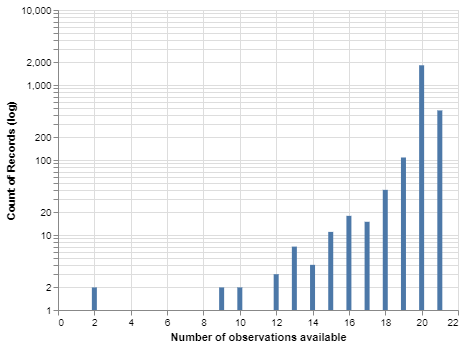
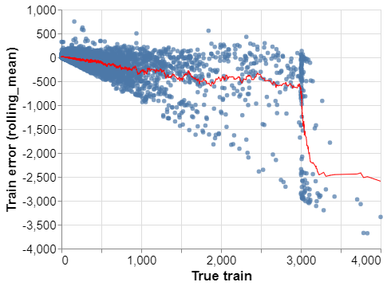
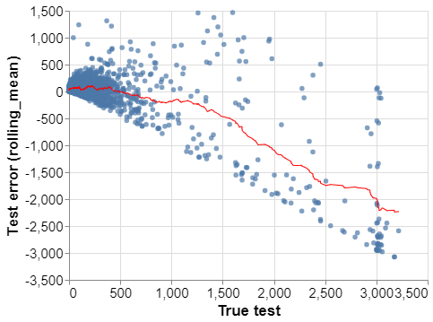
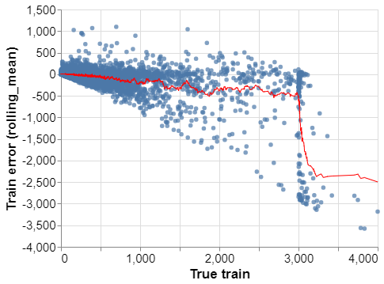
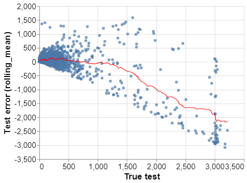
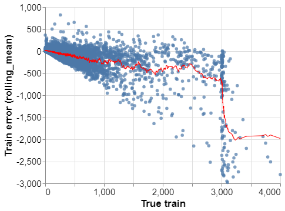
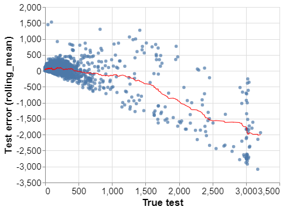

```{r setup, include=FALSE}
knitr::opts_chunk$set(echo = FALSE, warning = FALSE)

library(knitr)
library(kableExtra)
library(tidyverse)
```


## Introduction and purpose

The Master of Data Science program at the University of British Columbia is a professional graduate degree program which enables students to build a solid foundation in the areas of computer science and statistics. During the last two months of the program, students have the opportunity to apply the skills they gained in the classroom to real-world challenges. More information about the capstone project can be found [here](https://ubc-mds.github.io/capstone/about/). Under the supervision of an academic mentor, our team was brought on to address the following question: how many sessions took place on a playground in a given month?

This report serves four purposes: (1) help individuals navigate our GitHub repository; (2) discuss our analysis and findings; (3) report the performances of selected models; and (4) provide recommendations on how to move forward.

## Description of the data

Exploratory data analysis was performed at the beginning of the project. The code for the exploratory data analysis can be found in the [`/eda`](https://github.com/Z2hMedia/capstone_machine_learning/tree/master/eda) directory.

The key observations are as follows. First, the marginal distribution of the `unacast_session_count` has a positive skew (Figure 1). 

```{r Figure 1, echo=FALSE, message=FALSE, fig.cap="Figure 1. Marginal distribution of the target variable."}

```

Second, Figure 2 shows the sparsity of the data. Many of the features derived from data collected through the app contain 0s in the original dataset.

``` {r Figure 2, echo=FALSE, message=FALSE, fig.cap="Figure 2. Histogram of the proportion of 0s in each of the 860 explanatory variables."}

```

Third, missing values were present in both the explanatory and response variables. The presence of missing values across the explanatory variables is summarized in Figure 3.

``` {r Figure 3, echo=FALSE, message=FALSE, fig.cap="Figure 3. Histogram of the proportion of missing values in each of the 860 explanatory variables."}

```

The next two histograms illustrate the distribution of missing `unacast_session_count`. As shown in Figure 4, there are a handful of playgrounds that have the target value available for fewer than half of the months.

``` {r Figure 4, echo=FALSE, message=FALSE, fig.cap="Figure 4. Histogram of the number of target values available for each of the 2506 playgrounds."}

```

Figure 5 suggests that the target value for January 2018 is missing for many playgrounds. The jump from January to February of that year can be attributed to Unacast’s SDK being incorporated into more apps, thereby tracking more users. Since the location data for January 2018 captures a smaller population than those captured in the following months, observations from the first month were removed from subsequent analysis.

``` {r Figure 5, echo=FALSE, message=FALSE, fig.cap="Figure 5. Histogram of the number of target values available for each month included in the data set aside for modeling."}

```

Exploratory data analysis also revealed the possible duplication of information in the dataset. For example, among the features derived from the U.S. Census, information related to sex is encoded in several places (i.e. “Sex by Age”, “Sex by Marital Status”, “Sex by School Enrollment”). Upon closer inspection of the dataset, we also discovered that some columns are merely the sum of others. The pattern can be observed among the U.S. Census-related features; for example, `B13016e2`(“Women Who Had a Birth by Age: Total”) is the sum of `B13016e3` through `B13016e9`. On a similar note, we also noticed that some columns can be obtained by linear transformations of other columns. `streets_per_node_counts_*` and `streets_per_node_proportion_*` are a great example of this because one is just a normalized version of the other.
 
## Rationale behind the output

At first, we considered creating regression models that output either a confidence interval or probability distribution. Since the marginal distribution of `unacast_session_count` is skewed, we thought that these kinds of estimates would be more robust to outliers than a single-value prediction. However, given that the end users (i.e. playground owners and managers) are more comfortable working with single-value predictions than estimates that incorporate uncertainty, we chose to build models that predict either the mean or median `unacast_session_count`. The performance of these models were evaluated using the root mean squared error (RMSE) and mean absolute error (MAE), respectively. Quantile regression was also pursued here because the median is less sensitive to extreme values than the mean.

## Rationale behind the hold-out set

The original data consisted of 24 monthly observations for 2506 Biba-enabled playgrounds in the United States. The dates ranged from January 2018 to December 2019. However, as mentioned in the previous section, observations from January 2018 were excluded from modeling. It was also found that one playground was actually located in Canada. All observations from that playground were subsequently removed. The observations from the last three months (October 2019 to December 2019) were set aside for model testing. Observations from February 2018 through September 2019 were randomly assigned to training and validation sets using scikit-learn’s `train_test_split` with one exception. When pursuing a time-series approach, to avoid data leakage, the training set consisted of observations from February 2018 through June 2019 while the validation set consisted of observations from July 2019 through September 2019. 

## Analysis with the original dataset

The data used in this iteration of modeling can be found [here](https://github.com/Z2hMedia/capstone_machine_learning/blob/master/data/old_train_data.zip). On Google Drive, it is saved as `playground_stats.csv`. Since the focus of this iteration was to evaluate the baseline performance of rudimentary models, emphasis was not placed on perfecting preprocessing techniques. For this reason, rows missing the target value were dropped and missing values in the explanatory variables were imputed with 0s. [`/src/scripts_misc/preprocessing_old.py`](https://github.com/Z2hMedia/capstone_machine_learning/blob/master/src/scripts_misc/preprocessing_old.py) contains the functions that were used to clean the data prior to modeling.

Ten algorithms were used. Table 1 shows where the .ipynb file for each algorithm can be found.

Table 1. Locations of .ipynb files containing modeling work using the old dataset.

| Filename  | Algorithm(s) |
|--:|:-:|
| [`/src/training_LGBM_01.ipynb`](https://github.com/Z2hMedia/capstone_machine_learning/blob/master/src/training_LGBM_01.ipynb)  | `LinearRegression`, `Ridge`, `Lasso`, `ElasticNet`, `LGBMRegressor`|
| [`/src/training_random_forest_01.ipynb`](https://github.com/Z2hMedia/capstone_machine_learning/blob/master/src/training_random_forest_01.ipynb)  | `RandomForestRegressor`  |
| [`/src/training_gradient_boost_01.ipynb`](https://github.com/Z2hMedia/capstone_machine_learning/blob/master/src/training_gradient_boost_01.ipynb)  | `GradientBoostingRegressor`, `XGBRegressor` |
| [`/src/training_SVR_CatBoost_01.ipynb`](https://github.com/Z2hMedia/capstone_machine_learning/blob/master/src/training_SVR_CatBoost_01.ipynb)  | `SVR`, `CatBoostRegressor` |

Across the board, the validation RMSE values were in the range of 250 to 770 sessions.

We also fit models to data in which the number of dimensions was reduced via PCA. PCA was performed in two ways: (1) on the whole dataset and (2) on groups of related columns. [`/src/scripts_misc/PCA_data.py`](https://github.com/Z2hMedia/capstone_machine_learning/blob/master/src/scripts_misc/PCA_data.py) contains the functions used to perform PCA. Table 2 describes where the relevant work can be found.

Table 2. Locations of .ipynb files containing modeling work on data in which PCA was applied.

| Filename  | Algorithm(s) |
|--:|:-:|
| [`/src/training_SVR_CatBoost_02.ipynb`](https://github.com/Z2hMedia/capstone_machine_learning/blob/master/src/training_SVR_CatBoost_02.ipynb) | `CatBoostRegressor` |
| [`/src/training_gradient_boost_01.ipynb`](https://github.com/Z2hMedia/capstone_machine_learning/blob/master/src/training_gradient_boost_01.ipynb)  | `GradientBoostingRegressor` |
| [`/src/training_LGBM_01.ipynb`](https://github.com/Z2hMedia/capstone_machine_learning/blob/master/src/training_LGBM_01.ipynb)  | `Ridge`, `LGBMRegressor` |

Out of curiousity, we also tried fitting models to data in which the playgrounds with historic session counts greater than 70000 were removed. This dramatically improved the fit of the model, decreasing the error in both the training and validation set. [`/src/training_gradient_boost_01.ipynb`](https://github.com/Z2hMedia/capstone_machine_learning/blob/master/src/training_gradient_boost_01.ipynb) illustrates the improvement in model performance.

## Analysis with an updated dataset 

The data used in this iteration of modeling can be found [here](https://github.com/Z2hMedia/capstone_machine_learning/blob/master/data/train_data.zip). On Google Drive, it is saved as `playground_stats_capped.csv`. The major difference between this dataset and the previous one is the range of the target variable. `unacast_session_count` values over 3000 were normalized to fall between 3000 and 4000.

Preprocessing techniques were reconsidered. As for imputation, we began by taking a closer look at each feature. In some features, missing values were in fact synonymous with 0s. In others, it made more sense to replace missing values with the mean or a specific value. For example, missing values related to presidential election results in Alaska were filled in manually. Feature engineering and selection were also performed to reduce dimensionality. This involved dropping columns with low fill rates, removing correlated features, and combining columns using domain knowledge. The discussion surrounding feature engineering and selection is documented [here](https://github.com/Z2hMedia/capstone_machine_learning/issues/95). [`/src/scripts_misc/imputer.py`](https://github.com/Z2hMedia/capstone_machine_learning/blob/master/src/scripts_misc/imputer.py), [`/src/scripts_misc/feature_eng.py`](https://github.com/Z2hMedia/capstone_machine_learning/blob/master/src/scripts_misc/feature_eng.py), and [`/src/scripts_misc/drop.py`](https://github.com/Z2hMedia/capstone_machine_learning/blob/master/src/scripts_misc/drop.py) contain the functions that were used to preprocess the input data.

Ten different kinds of models were pursued during this iteration. Table 3 shows where the relevant work for each model can be located. It should be mentioned that Jupyter notebooks were run on Amazon EC2 to reduce computation time. 

Table 3. Locations of .ipynb files containing modeling work using the updated dataset (`playground_stats_capped.csv`). Models that were evaluated using the RMSE predicted the conditional *mean*. On the other hand, those that were evaluated using the MAE predicted the conditional *median*. The tiered model was comprised of two regression models which were both optimized to minimize the RMSE.

| Filename  | Algorithm(s)  | Lagged values  | Random effects  |  Evaluation  |
|--:|:-:|:-:|:-:|:-:|
| [`/src/training_SVR_CatBoost_02.ipynb`](https://github.com/Z2hMedia/capstone_machine_learning/blob/master/src/training_SVR_CatBoost_02.ipynb)  |  `SVR` | Not included  | Not included  | RMSE, MAE  |
| [`/src/training_SVR_CatBoost_02.ipynb`](https://github.com/Z2hMedia/capstone_machine_learning/blob/master/src/training_SVR_CatBoost_02.ipynb)  | `CatBoostRegressor`  | Not included  | Not included  | RMSE, MAE  |
| [`/src/training_LGBM_02.ipynb`](https://github.com/Z2hMedia/capstone_machine_learning/blob/master/src/training_LGBM_02.ipynb)  | `LGBMRegressor`  | Not included  | Not included  | RMSE, MAE  |
| [`/src/training_random_forest_02.ipynb`](https://github.com/Z2hMedia/capstone_machine_learning/blob/master/src/training_random_forest_02.ipynb)  | `RandomForestRegressor`  |  Not included  | Not included  | RMSE   |
| [`/src/training_gradient_boost_02.ipynb`](https://github.com/Z2hMedia/capstone_machine_learning/blob/master/src/training_gradient_boost_02.ipynb)  | `GradientBoostingRegressor`  | Not included  | Not included  | RMSE, MAE  |
| [`/src/training_gradient_boost_02.ipynb`](https://github.com/Z2hMedia/capstone_machine_learning/blob/master/src/training_gradient_boost_02.ipynb)  | `XGBRegressor`  |  Not included | Not included | RMSE |
| [`/src/training_time_dependent.ipynb`](https://github.com/Z2hMedia/capstone_machine_learning/blob/master/src/training_time_dependent.ipynb)  | `XGBRegressor`  | Included  | Not included  | RMSE |
| [`/src/training_mixed_effects_Python.ipynb`](https://github.com/Z2hMedia/capstone_machine_learning/blob/master/src/training_mixed_effects_Python.ipynb)   | `smf` | Not included  | `income_class`, `density_class`, `climate`  | RMSE, MAE  |
| [`/src/training_mixed_effects_R.ipynb`](https://github.com/Z2hMedia/capstone_machine_learning/blob/master/src/training_mixed_effects_R.ipynb)  | `lmer`  | Not included   | `income_class`, `density_class`, `climate`; *k*-means clustering  | RMSE, MAE  |
| [`/src/training_tiered.ipynb`](https://github.com/Z2hMedia/capstone_machine_learning/blob/master/src/training_tiered.ipynb)  | `XGBClassifier`; `XGBRegressor`, `glm`  | Not included  | Not included  | Tiered |

With respect to the off-the-shelf regression algorithms (random forest and boosting methods), the validation RMSE values were in the range of 100 and 130 sessions. However, we believe that this improvement in model performance is most likely attributed to the capping of the target variable.

#### Time-series approach

A time-series approach was pursued in which the lagged target variable was included as an explanatory variable. We assumed that session counts would be similar across consecutive months for a given playground and would therefore serve as useful input signals. It is worth mentioning that, when fitting a `XGBRegressor` to this data, we optimized the hyperparameters using nested cross-validation as opposed to _k_-fold cross-validation because the prior is more robust to temporal dependence. However, we could not use scikit-learn's implementation of a time-series cross-validator because the number of observations for each month was inconsistent. As a result, we created our own implementation of nested cross-validation. With a validation RMSE value of 176 sessions, it did not outperform the off-the-shelf regression models mentioned above.

#### Mixed effects

We assumed that not every playground observes the same behaviour with respect to visits. For example, playgrounds located in warmer climates may observe more visits in the spring or fall because it is unpleasantly hot in the summer. Meanwhile, playgrounds located in cooler climates may observe more visits in the summer because it is too cold to play outside in the winter. We could have fit a unique regression surface to observations derived from each playground, but it would have been unreasonable to create 2500 models and impossible to predict `unacast_session_count` for new playgrounds. A reasonable solution to incorporating these across-group differences was to build mixed effects models. We grouped the playgrounds using a specific characteristic and then fit a regression surface. However, each group was allowed to have its own intercept. As a result, information was shared across the groups to determine the regression surface, but the generated model was less generic than a pooled regression model.

We built these models using both R (`lmer` function) and Python (`smf` function from the `statsmodels.formula.api` library).
  
In R, we grouped the observations using levels of categorical variables (i.e. `state`, `climate`, `density_class`, `income_class`). None of the models outperformed the off-the-shelf regression models mentioned earlier. The validation RMSE and MAE values were around 200 sessions and 100 sessions, respectively. We also applied k-means clustering with _k_ = 2, 4 to see if more meaningful groups could be obtained. However, it should be mentioned that, with this grouping strategy, observations from the same playground could have been placed in different clusters. Unfortunately, implementing the new grouping strategy resulted in similar validation RMSE and MAE values as described earlier.  

Building a mixed effects model in Python was troublesome because the `smf` function did not have an argument that allowed for the automatic dropping of columns that made the algorithm not converge. To compensate, we had to write a function that dropped these problematic columns. Similar to the implementation in R, observations were grouped using levels of categorical variables (i.e. `climate`, `density_class`, `income_class`). The results were similar to that of the R implementation with validation RMSE and MAE values of around 200 sessions and 100 sessions, respectively. 
  
#### Tiered approach

We also considered a tiered approach. This model consisted of a classifier which would predict an observation to be either low count or high count (i.e. below or above 300 sessions). Based on that decision, a prediction would be made using a regressor that was trained on low-count or high-count data. An `XGBClassifier` was created and its F1 score of the low-count class was 0.99 and that of the high-count class was 0.85. Given the skewness in the data, poisson regression was used to predict `unacast_session_count` for the high-count data. However, its validation RMSE was 1.22287e+73 sessions. Other generalized linear models suitable for count data were considered (e.g. negative binomial); however, the algorithm would not converge and model coefficients could not be obtained. On the other hand, regression models built for the low-count data using `LinearRegression` and `XGBRegressor` had validation RMSE values of 54 sessions and 35 sessions, respectively. However, we acknowledge that these values are not reflective of the performance of the tiered model as a whole. It should be mentioned that these low-count and high-count regression models could have been consolidated into a weight sum model. Instead of a label, the classifier could have predicted class probabilities. Then, the predicted probabilities could have been used to weigh the estimated session counts derived from the two different regression models. 

#### Residual plots

In order to assess the fit of the model, we created residual plots. In these plots, we observed a trend in the residuals. Residual plots derived from the median-predicting `GradientBoostingRegressor`, `LGBMRegressor`, and `CatBoostRegressor` models are shown below.

|  |   |
|---|---|
|*Training data* {width=35%} | *Test data* {width=35%}|
Figure 6. Residual plots of the median-predicting `GradientBoostingRegressor` model.

|   |   |
|---|---|
|*Training data* {width=35%} | *Test data* {width=35%}|
Figure 7. Residual plots of the median-predicting `LGBMRegressor` model.

|   |   |
|---|---|
|*Training data* {width=35%} | *Test data* {width=35%}|
Figure 8. Residual plots of the median-predicting `CatBoostRegressor` model.

The residuals (error values) are calculated as predicted minus true. It should also be emphasized that negative predicted values were converted to 0 prior to this calculation. With respect to the residual plots for the training data, a similar trend is observed across the three models. The error value decreases linearly from 0 to -500 as the true training value increases from 0 to 3000. This suggests that the bias is higher for high-count predictions. The large drop observed around the 3000 mark could be attributed to the fact that `unacast_session_count` above 3000 were normalized to fall between 3000 and 4000. Beyond a true training value of 3500, the error values hover around -2500.

As for the residual plots for the test data, in all three models, the error value deviates away from 0 as the true test value increases. However, there are no large drops observed here.

While the trend suggests that the models tend to underestimate for high-count predictions, it is worthwhile to mention that the deviation of the residual away from 0 does not necessarily suggest that the prediction is worse for larger values. It is important to consider the percentage error. That is to say, even if the prediction is off by 50 sessions, perhaps the error is still within a sensible range if the actual number of sessions is 500.

## Data product

#### Results

Our data product consists of three boosting models that predict the median `unacast_session_count`. We selected these models because they are least worst-performing models we came across in our analysis, they are relatively fast to train, and the median is less sensitive to extreme values than the mean, as mentioned earlier. Their performance is as follows:

``` {r Model performance, echo=FALSE, message=FALSE}
gbr <- read_csv("../results/gbr_train_result.csv")
lgbm <- read_csv("../results/lgbm_train_result.csv")
cat <- read_csv("../results/catboost_train_result.csv") %>%
  mutate(model = 'CatBoost')

df <- rbind(gbr, lgbm, cat)

# Wrangle data for readability
df <- df %>%
  rename(`train MAE` = `train mae`,
         `test MAE` = `test mae`) %>%
  mutate(model = case_when(model == "GradientBoostedRegressor" ~ "GradientBoostingRegressor",
                           model == "LightGBM" ~ "LGBMRegressor ",
                           model == "CatBoost" ~ "CatBoostRegressor"),
         `train MAE`= round(`train MAE`, 2),
         `test MAE` = round(`test MAE`, 2)
)

kable(df)
```

#### Reproducing the data analysis

Instructions on how to run the Makefile to reproduce this report can be found [here](https://github.com/Z2hMedia/capstone_machine_learning/blob/master/README.md). This Makefile automates the execution of five scripts. The first script [`/src/01_split_data.py`](https://github.com/Z2hMedia/capstone_machine_learning/blob/master/src/01_split_data.py) splits the raw data into the training and test sets. The second script [`/src/02_preprocessing.py`](https://github.com/Z2hMedia/capstone_machine_learning/blob/master/src/02_preprocessing.py) fits an imputer and one-hot encoder on the training set and saves them as .joblib files for later use. It also transforms the training and test sets and saves them as .zip files in the [`/data`](https://github.com/Z2hMedia/capstone_machine_learning/tree/master/data) directory. Smaller versions of the training and test sets are also saved as .zip files to serve as dummy data for unit testing. It should be noted that the preprocessing methods used here are identical to those used in the second iteration of modeling. **Note: features are  not scaled because tree-based models are not sensitive to scaling.** [`/src/03_gbr_model.py`](https://github.com/Z2hMedia/capstone_machine_learning/blob/master/src/03_gbr_model.py), [`/src/04_catboost_model.py`](https://github.com/Z2hMedia/capstone_machine_learning/blob/master/src/04_catboost_model.py), and [`/src/05_lgbm_model.py`](https://github.com/Z2hMedia/capstone_machine_learning/blob/master/src/05_lgbm_model.py) are the scripts in which modeling take place. The hyperparameters are hard coded based on the results of the random searches performed in the second iteration of modeling. In each script, a model is fit and then used to predict on the training and test sets. Since these models can predict negative values, the nonsensical predictions are converted to 0 prior to calculating the MAE. Each model is saved as a .joblib file and its performance metrics are saved as a .csv file in the [`/results`](https://github.com/Z2hMedia/capstone_machine_learning/tree/master/results) directory. This file, which is not part of the Makefile, renders this report.

#### Predicting on new data

It is also possible to predict `unacast_session_count` values for an unseen dataset using the models described above. Instructions on how to run the Makefile to predict on new data can be found [here](https://github.com/Z2hMedia/capstone_machine_learning/blob/master/README.md). The data is preprocessed in the same way as described above: the imputer and one-hot encoder from earlier is loaded to transform the data. [`/src/07_prediction.py`](https://github.com/Z2hMedia/capstone_machine_learning/blob/master/src/07_prediction.py) outputs a .zip file in the [`/results`](https://github.com/Z2hMedia/capstone_machine_learning/tree/master/results) directory. Non-negative predictions from the three models are added as new columns to the input data.

## Recommendations

#### Outliers in the target

It was demonstrated again and again that outliers in `unacast_session_count` were detrimental to model fit. In the future, other statistical or machine learning models that are more robust to outliers could be pursued. Alternatively, the strategy of fitting multiple hyperplanes to the data could be considered further. However, we believe that the most effective strategy for improving model fit is to reevaluate how the target value is calculated using cell phone location data. Perhaps the polygon that is drawn around some playgrounds are ill-shaped, giving the impression that more playground visits took place than there actually were.

#### Missing values in the target

Prior to modeling, we simply removed rows with missing target values. However, we stress that these values can be dealt with more elegantly. If, for a particular playground, back-to-back missing target values are followed by months for which the values are available, this might suggest that the playground was not in operation during the former months. In such cases, the missing values could be imputed with 0s. In other situations, where the reason for the missing value is unclear or the true value cannot be inferred, it may be worth continuing to drop the entire observation. These scenarios demonstrate that there is no one-size-fits-all approach.

#### Missing values in explanatory variables

We dropped a handful of columns with a high proportion of missing values (e.g. `transit_score`). However, the information that could be contained within these features may be inherently important in predicting the target value. If time and resources permit, it may be worth consulting additional external sources to fill in those values.

#### Feature engineering and selection

This may not improve model fit, but further manipulation of the raw data may allow for other algorithms, which were initially not used for reasons related to time complexity, to be considered. 

## Conclusion

Although the models are in need of improvement, we hope that our work has at least brought the organization closer to attaining a reliable predictor that can be used to inform the decision-making process around community play spaces. It should also be mentioned that these models were fit to data collected before the pandemic. Although people are returning to playgrounds as restrictions ease, these models may only be reflective of pre-pandemic behaviour. Further model tuning may be required to incorporate the behavioural changes that took place and are continuing to take place in society. 

## Acknowledgements

We would like to thank Biba Ventures Inc. for sharing their resources and providing unparalleled support over the course of this project. We extend our gratitude to our mentor, Vincenzo Coia, and the UBC MDS program for making this experience possible. 