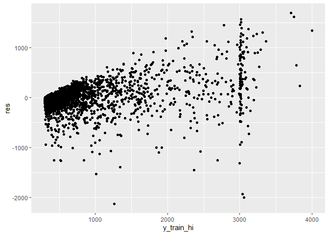
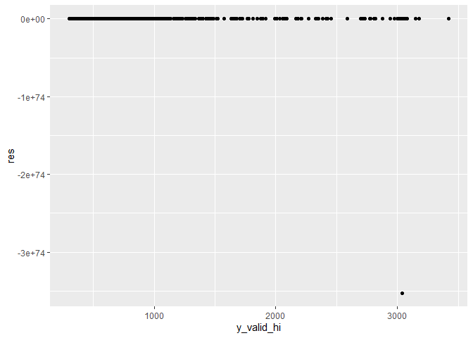
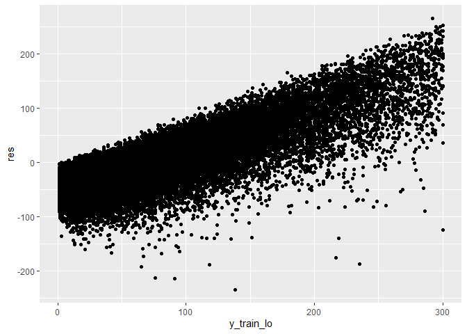
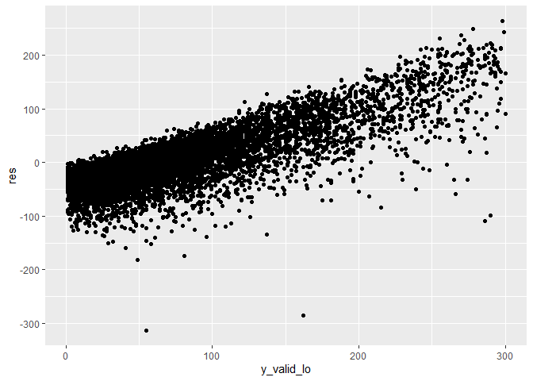

classifier\_poisson
================

Load the data for *high* observations:

``` r
X_train_hi <- read_csv("../data/X_train_hi.csv")
```

    ## Warning: Missing column names filled in: 'X1' [1]

``` r
X_valid_hi <- read_csv("../data/X_valid_hi.csv")
```

    ## Warning: Missing column names filled in: 'X1' [1]

``` r
y_train_hi <- read_csv("../data/y_train_hi.csv")
```

    ## Warning: Missing column names filled in: 'X1' [1]

``` r
y_valid_hi <- read_csv("../data/y_valid_hi.csv")
```

    ## Warning: Missing column names filled in: 'X1' [1]

Load the data for *low* observations:

``` r
X_train_lo <- read_csv("../data/X_train_lo.csv")
```

    ## Warning: Missing column names filled in: 'X1' [1]

``` r
X_valid_lo <- read_csv("../data/X_valid_lo.csv")
```

    ## Warning: Missing column names filled in: 'X1' [1]

``` r
y_train_lo <- read_csv("../data/y_train_lo.csv")
```

    ## Warning: Missing column names filled in: 'X1' [1]

``` r
y_valid_lo <- read_csv("../data/y_valid_lo.csv")
```

    ## Warning: Missing column names filled in: 'X1' [1]

### Analysis for *high* observations

``` r
X_train_hi <- X_train_hi %>%
  dplyr::select(-X1)

X_valid_hi <- X_valid_hi %>%
  dplyr::select(-X1)

y_train_hi <- y_train_hi$unacast_session_count

y_valid_hi <- y_valid_hi$unacast_session_count

X_train_hi_model <- X_train_hi %>%
  mutate(target = y_train_hi - 300)
```

Fit a poisson regression model:

``` r
poisson_hi <- glm(formula = target ~ ., family = "poisson", data = X_train_hi_model)
```

Print out fitted model:

``` r
poisson_hi %>%
  broom::tidy()
```

    ## # A tibble: 514 x 5
    ##    term                          estimate    std.error statistic   p.value
    ##    <chr>                            <dbl>        <dbl>     <dbl>     <dbl>
    ##  1 (Intercept)                   -1.23e+3 5.10           -242.   0.       
    ##  2 month                          8.77e-2 0.000427        206.   0.       
    ##  3 year                           6.11e-1 0.00243         251.   0.       
    ##  4 monthly_number_of_sessions     9.80e-3 0.00192           5.09 3.52e-  7
    ##  5 monthly_unique_sessions       -8.87e-2 0.00225         -39.4  0.       
    ##  6 monthly_avg_length_of_session  2.38e-7 0.0000000139     17.2  3.59e- 66
    ##  7 monthly_avg_light_activity    -8.11e-7 0.0000000222    -36.5  7.68e-292
    ##  8 monthly_avg_moderate_activity -2.55e-7 0.0000000371     -6.88 6.03e- 12
    ##  9 monthly_avg_vigorous_activity  1.24e-6 0.0000000585     21.3  3.26e-100
    ## 10 monthly_count_zipline          1.68e+0 0.147            11.4  3.40e- 30
    ## # ... with 504 more rows

Residual plot for training data:

``` r
y_pred_train_hi <- predict(poisson_hi, X_train_hi, type="response") %>%
  broom::tidy() %>%
  mutate(x = x + 300) %>%
  pull(x)
```

    ## Warning in predict.lm(object, newdata, se.fit, scale = 1, type = if (type == :
    ## prediction from a rank-deficient fit may be misleading

    ## Warning: 'tidy.numeric' is deprecated.
    ## See help("Deprecated")

``` r
hi_train <- data.frame(y_train_hi, y_pred_train_hi) %>%
  mutate(res = y_train_hi - y_pred_train_hi)

ggplot(hi_train, aes(y_train_hi, res)) + 
  geom_point()
```

<!-- -->

Print RMSE for training data:

``` r
Metrics::rmse(hi_train$y_train_hi, hi_train$y_pred_train_hi)
```

    ## [1] 266.6552

Residual plot for validation data:

``` r
y_pred_valid_hi <- predict(poisson_hi, X_valid_hi, type="response") %>%
  broom::tidy() %>%
  mutate(x = x + 300) %>%
  pull(x)
```

    ## Warning in predict.lm(object, newdata, se.fit, scale = 1, type = if (type == :
    ## prediction from a rank-deficient fit may be misleading

    ## Warning: 'tidy.numeric' is deprecated.
    ## See help("Deprecated")

``` r
hi_valid <- data.frame(y_valid_hi, y_pred_valid_hi) %>%
  mutate(res = y_valid_hi - y_pred_valid_hi)

ggplot(hi_valid, aes(y_valid_hi, res)) + 
  geom_point()
```

<!-- -->

Print RMSE for validation data:

``` r
Metrics::rmse(hi_valid$y_valid_hi, hi_valid$y_pred_valid_hi)
```

    ## [1] 1.22287e+73

Identify the anomaly:

``` r
outlier <- hi_valid %>%
  arrange(res) %>%
  head(1) %>%
  pull(y_valid_hi)

X_valid_hi_w_target <- X_valid_hi %>%
  mutate(target = y_valid_hi) 

X_valid_hi_w_target %>%
  filter(target == outlier)
```

    ## # A tibble: 2 x 633
    ##   month  year monthly_number_~ monthly_unique_~ monthly_repeate~
    ##   <dbl> <dbl>            <dbl>            <dbl>            <dbl>
    ## 1     1  2019               38                1               37
    ## 2     9  2019                0                0                0
    ## # ... with 628 more variables: monthly_avg_length_of_session <dbl>,
    ## #   monthly_avg_light_activity <dbl>, monthly_avg_moderate_activity <dbl>,
    ## #   monthly_avg_vigorous_activity <dbl>, monthly_count_ramp <dbl>,
    ## #   monthly_count_zipline <dbl>, monthly_count_spinner <dbl>,
    ## #   monthly_count_pull_under <dbl>, monthly_under_40 <dbl>,
    ## #   monthly_temp_40_to_50 <dbl>, monthly_temp_50_to_60 <dbl>,
    ## #   monthly_temp_60_to_70 <dbl>, monthly_temp_70_to_80 <dbl>,
    ## #   monthly_temp_80_to_90 <dbl>, monthly_over_90 <dbl>,
    ## #   monthly_avg_length_under_40 <dbl>, monthly_avg_length_temp_40_to_50 <dbl>,
    ## #   monthly_avg_length_temp_50_to_60 <dbl>,
    ## #   monthly_avg_length_temp_60_to_70 <dbl>,
    ## #   monthly_avg_length_temp_70_to_80 <dbl>,
    ## #   monthly_avg_length_temp_80_to_90 <dbl>, monthly_avg_length_over_90 <dbl>,
    ## #   monthly_cloudy <dbl>, monthly_clear <dbl>, monthly_foggy <dbl>,
    ## #   monthly_rain <dbl>, monthly_snow <dbl>, monthly_avg_cloudy_length <dbl>,
    ## #   monthly_avg_clear_length <dbl>, monthly_avg_foggy_length <dbl>,
    ## #   monthly_avg_rain_length <dbl>, monthly_avg_snow_length <dbl>,
    ## #   monthly_hour_7 <dbl>, monthly_hour_8 <dbl>, monthly_hour_9 <dbl>,
    ## #   monthly_hour_10 <dbl>, monthly_hour_11 <dbl>, monthly_hour_12 <dbl>,
    ## #   monthly_hour_13 <dbl>, monthly_hour_14 <dbl>, monthly_hour_15 <dbl>,
    ## #   monthly_hour_16 <dbl>, monthly_hour_17 <dbl>, monthly_hour_18 <dbl>,
    ## #   monthly_hour_19 <dbl>, monthly_hour_20 <dbl>, monthly_hour_21 <dbl>,
    ## #   distance_to_nearest_bus_stop <dbl>, B20004e10 <dbl>, B11016e1 <dbl>,
    ## #   B12001e12 <dbl>, B20004e11 <dbl>, B19125e1 <dbl>, B12001e13 <dbl>,
    ## #   B23008e22 <dbl>, B11005e12 <dbl>, B19101e10 <dbl>, B23008e25 <dbl>,
    ## #   B19055e2 <dbl>, B19101e14 <dbl>, B12001e10 <dbl>, B23008e24 <dbl>,
    ## #   B17020e13 <dbl>, B12001e14 <dbl>, B12001e19 <dbl>, B11005e13 <dbl>,
    ## #   B08301e21 <dbl>, B20004e15 <dbl>, B01001e26 <dbl>, B20004e17 <dbl>,
    ## #   B20004e18 <dbl>, B12001e17 <dbl>, B23008e21 <dbl>, B23008e20 <dbl>,
    ## #   B12001e18 <dbl>, B23008e17 <dbl>, B23008e23 <dbl>, B08303e11 <dbl>,
    ## #   B11005e19 <dbl>, B20004e16 <dbl>, B20004e13 <dbl>, B08301e10 <dbl>,
    ## #   B11005e18 <dbl>, B11005e16 <dbl>, B12001e11 <dbl>, B20004e14 <dbl>,
    ## #   B19055e3 <dbl>, B23008e26 <dbl>, B11005e14 <dbl>, B17020e14 <dbl>,
    ## #   B13014e15 <dbl>, B25012e13 <dbl>, B11005e2 <dbl>, B11005e11 <dbl>,
    ## #   B17020e12 <dbl>, B11005e17 <dbl>, B20004e9 <dbl>, B19101e7 <dbl>,
    ## #   B19101e4 <dbl>, B23008e15 <dbl>, ...

### Analysis for *low* observations

``` r
X_train_lo <- X_train_lo %>%
  dplyr::select(-X1)

X_valid_lo <- X_valid_lo %>%
  dplyr::select(-X1)

y_train_lo <- y_train_lo$unacast_session_count

y_valid_lo <- y_valid_lo$unacast_session_count

X_train_lo_model <- X_train_lo %>%
  mutate(target = y_train_lo)
```

Fit a poisson regression model:

``` r
poisson_lo <- glm(formula = target ~ ., family = "poisson", data = X_train_lo_model)
```

Print out fitted model:

``` r
poisson_lo %>%
  broom::tidy()
```

    ## # A tibble: 521 x 5
    ##    term                          estimate     std.error statistic  p.value
    ##    <chr>                            <dbl>         <dbl>     <dbl>    <dbl>
    ##  1 (Intercept)                   -6.75e+2 2.87            -235.   0.      
    ##  2 month                          4.81e-2 0.000262         183.   0.      
    ##  3 year                           3.37e-1 0.00142          237.   0.      
    ##  4 monthly_number_of_sessions    -4.83e-1 0.0842            -5.74 9.28e- 9
    ##  5 monthly_unique_sessions        9.82e-3 0.000840          11.7  1.31e-31
    ##  6 monthly_avg_length_of_session  1.64e-8 0.00000000699      2.35 1.87e- 2
    ##  7 monthly_avg_light_activity     2.44e-8 0.0000000123       1.98 4.74e- 2
    ##  8 monthly_avg_moderate_activity -1.08e-7 0.0000000157      -6.90 5.35e-12
    ##  9 monthly_avg_vigorous_activity  7.44e-8 0.0000000212       3.50 4.58e- 4
    ## 10 monthly_count_ramp            -3.36e-1 0.133             -2.52 1.17e- 2
    ## # ... with 511 more rows

Residual plot for training data:

``` r
y_pred_train_lo <- predict(poisson_lo, X_train_lo, type="response") %>%
  broom::tidy() %>%
  pull(x)
```

    ## Warning in predict.lm(object, newdata, se.fit, scale = 1, type = if (type == :
    ## prediction from a rank-deficient fit may be misleading

    ## Warning: 'tidy.numeric' is deprecated.
    ## See help("Deprecated")

``` r
lo_train <- data.frame(y_train_lo, y_pred_train_lo) %>%
  mutate(res = y_train_lo - y_pred_train_lo)

ggplot(lo_train, aes(y_train_lo, res)) + 
  geom_point()
```

<!-- -->

Print RMSE for training data:

``` r
Metrics::rmse(lo_train$y_train_lo, lo_train$y_pred_train_lo)
```

    ## [1] 52.78069

Residual plot for validation data:

``` r
y_pred_valid_lo <- predict(poisson_lo, X_valid_lo, type="response") %>%
  broom::tidy() %>%
  pull(x)
```

    ## Warning in predict.lm(object, newdata, se.fit, scale = 1, type = if (type == :
    ## prediction from a rank-deficient fit may be misleading

    ## Warning: 'tidy.numeric' is deprecated.
    ## See help("Deprecated")

``` r
lo_valid <- data.frame(y_valid_lo, y_pred_valid_lo) %>%
  mutate(res = y_valid_lo - y_pred_valid_lo)

ggplot(lo_valid, aes(y_valid_lo, res)) + 
  geom_point()
```

<!-- -->

Print RMSE for validation data:

``` r
Metrics::rmse(lo_valid$y_valid_lo, lo_valid$y_pred_valid_lo)
```

    ## [1] 53.30865
